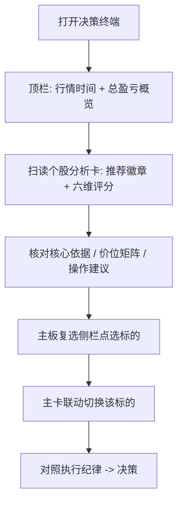

# 股市调研智能体 · 决策终端（前端）PRD

## 1. 产品概述
把股市调研智能体（stock_agent 的 6 阶段分析产出）以专业量化交易终端的形式可视化呈现。
- 面向使用策略 + DeepResearch + 分析结论做盘中决策的个人投资者/操盘者，将 verdict / 多维评分 / 策略符合度 / 价位 / 资讯流一屏呈现。
- 价值：把结构化 JSON 结论（verdict、synthesis、strategy_fit、risk_and_exec、research）转成可快速扫读的决策看板，降低决策摩擦。

## 2. 核心功能

### 2.1 用户角色
无需登录，单一操盘者视角（本期纯前端 + mock 数据，数据结构对齐 stock_agent 分析输出，便于后续接后端）。

### 2.2 功能模块
1. **决策终端主页（单页应用）**：顶部状态栏、个股分析卡区（双卡并排）、主板复选侧栏、执行纪律。

### 2.3 页面明细
| 页面名称 | 模块名称 | 功能描述 |
|---|---|---|
| 决策终端 | 顶部状态栏 | 显示终端标题、行情时间、连接/刷新状态、全局盈亏概览 |
| 决策终端 | 个股分析卡·卡头 | 股票代码/名称/更新时间，大号涨跌幅+涨跌额（红涨绿跌），持仓/成本/盈亏 或 无持仓·可买额 |
| 决策终端 | 个股分析卡·推荐结论 | 推荐动作徽章（推荐持有/推荐买入…映射 verdict.action）、排序度、风险值 |
| 决策终端 | 个股分析卡·核心依据面板 | 青绿色高亮面板：一句话结论+置信度，下挂多维依据标签（量能/成交量/均线/日内位置/主板热度/风险） |
| 决策终端 | 个股分析卡·观点切换 Tab | 推荐持有 / 最新观点 / 位置% 三个 Tab 切换内容 |
| 决策终端 | 个股分析卡·价位矩阵 | 低阻区/压力位、二支撑/均线值、成交量/计划买入 三行对照 |
| 决策终端 | 个股分析卡·多维评分 | 综合/价格/量能/逻辑/情绪/大盘 六维分值（映射 analysis 各阶段 confidence×100） |
| 决策终端 | 个股分析卡·运行进度条 | 微观运图（蓝，0–100）、综合度（红，当前分）两条进度条 |
| 决策终端 | 个股分析卡·操作建议 | 操作/买点/卖点 三段文字（映射 verdict.conditions + risk_and_exec） |
| 决策终端 | 个股分析卡·属性解读 | 价格/量能/逻辑/消息/大盘/预期 六条带色边的解读行 |
| 决策终端 | 个股分析卡·资讯流 | 时间戳倒序的数据/公告条目列表 |
| 决策终端 | 主板复选侧栏 | 标题+计数（如 18只），股票行：名称代码/价格/涨跌幅/市值/评分/推荐要点，可点选联动主卡 |
| 决策终端 | 执行纪律侧栏 | 先处理持仓、只买主板 等规则条目（映射 strategy.checks） |

## 3. 核心流程
操盘者打开终端 → 顶栏确认行情时间与总盈亏 → 扫读双卡的推荐徽章与六维评分 → 展开核心依据/价位/操作建议核对 → 在主板复选侧栏点选新标的 → 主卡切换为该标的分析 → 对照执行纪律决定动作。

## 4. 界面设计

### 4.1 设计风格
- 主色：深空背景 `#0a0e15` / 面板 `#111823`；主强调色 青绿 `#19d19f`（结论/评分）；涨=红 `#ff5b5b`、跌=绿 `#22c07a`；进度蓝 `#3f8cff`。
- 按钮/徽章：小圆角（4–6px）实心/描边混用，青绿描边高亮当前 Tab。
- 字体：显示/标签 `Chakra Petch`（几何科技感）；数字统一 `JetBrains Mono`（等宽对齐）；中文正文 `Noto Sans SC`。字号 11–13px 密集信息层级，大号涨跌幅 22–26px。
- 布局：网格化密集看板；主区双列卡片 + 右侧固定侧栏；卡内以细分隔线切分模块。
- 图标/emoji：极简线性图标，避免 emoji；用色块左边框区分属性行。

### 4.2 页面设计概览
| 页面名称 | 模块名称 | UI 要素 |
|---|---|---|
| 决策终端 | 卡头涨跌幅 | 大号等宽数字，红绿语义色，入场淡入+数字滚动动画 |
| 决策终端 | 核心依据面板 | 青绿半透明底 + 内发光边，标签胶囊横向 wrap |
| 决策终端 | 多维评分 | 六列分值 + 底部渐变刻度线，分值升起动画（stagger） |
| 决策终端 | 进度条 | 细高进度条，蓝/红填充带微光，宽度过渡动画 |
| 决策终端 | 属性解读行 | 左侧 3px 色边（按属性区分色），hover 行高亮 |
| 决策终端 | 主板复选行 | 悬停上移+边框点亮，选中态青绿左边条，评分大号右对齐 |

### 4.3 响应式
桌面优先（≥1280px 双列 + 侧栏）。<1024px 侧栏折叠为下方区块，卡片单列堆叠；保留等宽数字与语义色，触摸区≥36px。

## 5. 数据契约（对齐 stock_agent 输出，mock 化）
以 `ResearchContext.analysis` 为核心：`verdict{type,action,rating,rationale,conditions}`、`synthesis{net_bias,confidence}`、`strategy_fit{fit_score,entry/exit/risk,blocking_violations}`、`risk_and_exec{position_pct,stop_loss,invalidation,disclaimer}`、`research{score,digest,sources}`、`quality{score}`，外加行情字段 `quote{code,name,price,change_pct,change_abs}` 与持仓 `position{shares,cost,pnl,pnl_pct}`。侧栏为 `watchlist[]`，纪律为 `strategy.checks[]`。
