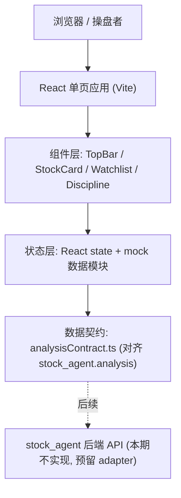

# 股市调研智能体 · 决策终端（前端）技术架构

## 1. 架构设计


## 2. 技术说明
- 前端：React@18 + TypeScript + tailwindcss@3 + Vite
- 初始化工具：vite-init（react-ts 模板）
- 动画：CSS 关键帧 + Motion（framer-motion）用于卡片入场/数字滚动/进度条过渡
- 字体：Chakra Petch + JetBrains Mono + Noto Sans SC（Google Fonts）
- 后端：无（纯前端，mock 数据）
- 数据库：无。mock 数据置于 `src/data/*.ts`，类型定义在 `src/types/analysis.ts`，结构对齐 `ResearchContext.analysis`，后续可用一个 adapter 把后端 JSON 映射为该类型，组件零改动。

## 3. 路由定义
| 路由 | 用途 |
|---|---|
| / | 决策终端主页（单页，所有模块） |

## 4. 组件结构
| 组件 | 职责 |
|---|---|
| `App` | 布局骨架：顶栏 + 主区(双卡) + 右侧栏；持有 selected watchlist 状态 |
| `TopBar` | 行情时间、刷新状态、总盈亏概览 |
| `StockCard` | 单只标的完整分析卡（卡头/结论/依据/Tab/价位/评分/进度/操作/属性/资讯），props 为 `StockAnalysis` |
| `ScoreGrid` | 六维评分展示 + 升起动画 |
| `ProgressBars` | 微观运图 / 综合度双进度条 |
| `AttributeRows` | 价格/量能/逻辑/消息/大盘/预期 解读行 |
| `NewsFeed` | 资讯流列表 |
| `Watchlist` | 主板复选侧栏，点选回调联动主卡 |
| `Discipline` | 执行纪律规则列表 |

## 5. 数据模型（TypeScript 类型，对齐 stock_agent）
```typescript
type DecisionType = 'stock_pick' | 'timing' | 'sector' | 'portfolio';

interface Quote { code: string; name: string; price: number; changePct: number; changeAbs: number; time: string; }
interface Position { has: boolean; shares?: number; cost?: number; pnl?: number; pnlPct?: number; buyableAmount?: number; buyableShares?: number; }
interface Scores { composite: number; price: number; volume: number; logic: number; sentiment: number; market: number; }
interface Levels { supportLow: number; resistance: number; secondSupport: number; maLine: number; turnover: string; plannedBuy: string; }
interface AttrRow { key: '价格'|'量能'|'逻辑'|'消息'|'大盘'|'预期'; text: string; }
interface NewsItem { time: string; text: string; }
interface Verdict { action: string; rating: string; rankScore: number; risk: number; headline: string; confidence: number; tags: string[]; ops: string; buyPoint: string; sellPoint: string; }
interface WatchItem { code: string; name: string; price: number; changePct: number; marketCap: string; score: number; note: string; }

interface StockAnalysis {
  quote: Quote; position: Position; verdict: Verdict;
  scores: Scores; microProgress: number; levels: Levels;
  attributes: AttrRow[]; news: NewsItem[];
}
```

## 6. 目录结构
```
stock-terminal/
  src/
    types/analysis.ts
    data/stocks.ts          # 双主卡 mock
    data/watchlist.ts       # 侧栏 mock
    data/discipline.ts      # 执行纪律 mock
    components/{TopBar,StockCard,ScoreGrid,ProgressBars,AttributeRows,NewsFeed,Watchlist,Discipline}.tsx
    styles/theme.css        # CSS 变量与全局样式
    App.tsx / main.tsx
  index.html / tailwind.config.js / vite.config.ts
```
